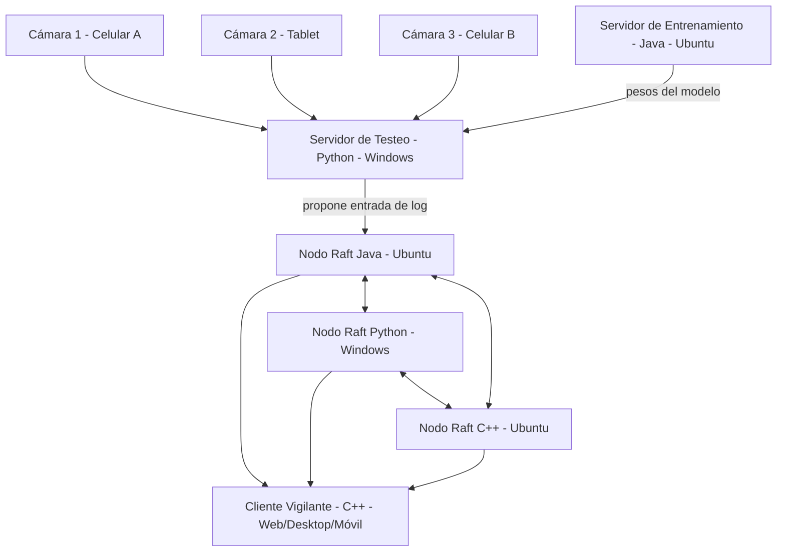

# CC4P1 — Sistema Distribuido de Reconocimiento con Consenso Raft
### Arquitectura del sistema y distribución de tareas (Grupo de 3 personas — Java, Python, C++)

---

## 1. Decisiones de diseño clave (leyendo bien las restricciones)

Antes del diagrama, estas son las decisiones que fijan todo lo demás:

| Restricción del enunciado | Decisión tomada |
|---|---|
| "Sólo el módulo de entrenamiento de IA como mínimo puede estar en Java" | El **entrenamiento** se hace en **Java** (obligatorio) |
| 3 alumnos → LP3 adicional | LP = **Java, Python, C++** |
| SO1 <> SO2 | **Ubuntu** y **Windows**, mezclados dentro del propio clúster Raft (no solo "un server en Windows y listo") |
| "Ejecutar en cluster con LP1, LP2, …, para verificar el consenso" | El clúster Raft es **heterogéneo**: cada persona corre **su propio nodo Raft en su propio lenguaje**, y los 3 hablan el mismo protocolo de wire por socket. Esto es lo que realmente demuestra consenso entre lenguajes/SO distintos, no solo entre 3 procesos del mismo binario. |
| Solo Sockets, nada de frameworks/MQ/websocket | Protocolo propio en texto plano o binario simple sobre TCP, implementado 3 veces (una por LP) |
| n objetos a reconocer (mayor n, mejor) | n = 4 clases: **Persona, Perro, Gato, Carro** |
| Mínimo 3 cámaras IP | 3 cámaras físicas = **celular + tablet + celular**, cada una transmite frames por socket propio hacia el Servidor de Testeo |
| Hilos para evitar corrupción de registros | Cada nodo Raft usa un hilo por conexión entrante + lock/mutex sobre el log y la máquina de estados |

---

## 2. Diagrama de arquitectura (vista general)

```
                         CÁMARAS (mínimo 3, vía celular/tablet)
        ┌───────────────┐   ┌───────────────┐   ┌───────────────┐
        │  Cámara 1     │   │  Cámara 2     │   │  Cámara 3     │
        │ (Celular A)   │   │ (Tablet)      │   │ (Celular B)   │
        │ app envía     │   │ app envía     │   │ app envía     │
        │ frames c/ N ms│   │ frames c/ N ms│   │ frames c/ N ms│
        └───────┬───────┘   └───────┬───────┘   └───────┬───────┘
                │  socket TCP crudo (frame JPEG + metadata)
                └───────────────┬───────────────────────┘
                                ▼
        ┌───────────────────────────────────────────────────┐
        │      SERVIDOR DE TESTEO DE OBJETOS (Python)        │
        │              [ Windows — SO2 ]                     │
        │  - Recibe frames de las 3 cámaras (1 hilo x cámara) │
        │  - Carga pesos entrenados (modelo.bin / modelo.pt)  │
        │  - Corre inferencia -> detecta clase (n=4)          │
        │  - Guarda imagen del objeto detectado en disco      │
        │  - Genera evento: {cámara, clase, fecha/hora, ruta} │
        └───────────────────────┬───────────────────────────┘
                                │ propone entrada de log (socket TCP)
                                ▼
        ┌─────────────────────────────────────────────────────────┐
        │              MÓDULO DE CONSENSO RAFT (heterogéneo)        │
        │                                                            │
        │   Nodo Raft #1        Nodo Raft #2        Nodo Raft #3     │
        │   Java                Python               C++             │
        │   Ubuntu (SO1)        Windows (SO2)        Ubuntu (SO1)     │
        │   ┌──────────┐        ┌──────────┐        ┌──────────┐     │
        │   │ Log       │◄─────►│ Log       │◄─────►│ Log       │     │
        │   │ Máquina   │       │ Máquina   │       │ Máquina   │     │
        │   │ de Estado │       │ de Estado │       │ de Estado │     │
        │   └──────────┘        └──────────┘        └──────────┘     │
        │        (mismo protocolo de wire por socket TCP, 3 LP)      │
        │   Elección de líder, replicación de log, tolerancia a      │
        │   fallos: si 1 nodo cae, los otros 2 mantienen quórum.     │
        └───────────────────────┬───────────────────────────────────┘
                                │ log replicado y consistente
                                ▼
        ┌─────────────────────────────────────────────────────────┐
        │        CLIENTE VIGILANTE DE OBJETOS (C++)                │
        │        Web/Desktop remoto + Móvil                        │
        │  - Lee el estado replicado (líder Raft actual)            │
        │  - Muestra tabla: foto, tipo objeto, fecha/hora, cámara n │
        │  - Si el líder cae, reconecta al nuevo líder (Raft)       │
        └─────────────────────────────────────────────────────────┘

        ┌─────────────────────────────────────────────────────────┐
        │      SERVIDOR DE ENTRENAMIENTO DE IA (Java)               │
        │              [ Ubuntu — SO1 ]                             │
        │  - Entrena modelo offline con dataset (n=4 clases)        │
        │  - Puede ser secuencial o paralelo (workers CPU)          │
        │  - Persiste pesos entrenados en archivo                   │
        │  - El Servidor de Testeo (Python) los consume al iniciar  │
        └─────────────────────────────────────────────────────────┘
```

### Diagrama Mermaid (equivalente, por si el visor lo soporta)



---

## 3. Diagrama de protocolo (secuencia de un evento de detección)

```
Cámara(n)      Servidor Testeo        Líder Raft         Nodo Raft 2/3        Cliente Vigilante
   │  frame          │                     │                    │                    │
   ├───────────────► │                     │                    │                    │
   │                 │  inferencia local   │                    │                    │
   │                 │  (modelo entrenado) │                    │                    │
   │                 │  guarda imagen      │                    │                    │
   │                 │  AppendEntry(evento)│                    │                    │
   │                 ├───────────────────► │                    │                    │
   │                 │                     │  replica entrada   │                    │
   │                 │                     ├──────────────────► │                    │
   │                 │                     │  ACK mayoría (2/3)  │                    │
   │                 │                     │◄──────────────────┤                    │
   │                 │  commit confirmado  │                    │                    │
   │                 │◄────────────────────┤                    │                    │
   │                 │                     │  (evento consolidado en máquina de      │
   │                 │                     │   estado -> disponible para lectura)    │
   │                 │                     │◄─────────────────────────────────────── │
   │                 │                     │  respuesta: registro actualizado ──────►│
```

Si el **líder cae**: los nodos restantes detectan el timeout de heartbeat, inician elección, un nuevo líder gana con mayoría (2 de 3), y el Cliente Vigilante reconecta automáticamente al nuevo líder sin perder el historial ya confirmado.

---

## 4. Resumen de nodos, lenguajes y sistemas operativos

| Nodo | Lenguaje | SO | Responsable |
|---|---|---|---|
| Servidor de Entrenamiento de IA | Java (mín. v8) | Ubuntu (SO1) | Persona 1 |
| Nodo Raft #1 | Java | Ubuntu (SO1) | Persona 1 |
| Servidor de Testeo de Objetos / recepción de cámaras | Python | Windows (SO2) | Persona 2 |
| Nodo Raft #2 | Python | Windows (SO2) | Persona 2 |
| Cliente Vigilante (web/desktop/móvil) | C++ | Ubuntu (SO1) | Persona 3 |
| Nodo Raft #3 | C++ | Ubuntu (SO1) | Persona 3 |

Con esto: SO1 (Ubuntu) ≠ SO2 (Windows), presentes ambos en el clúster; los 3 LP corren simultáneamente en el mismo consenso; y se cumple "grupo >2 alumnos desarrolla LP3 para otro nodo".

---

## 5. Distribución de tareas (3 partes — una por persona)

### 👤 Persona 1 — Java (Ubuntu)
**Bloque: Entrenamiento + Nodo Raft #1**
1. Servidor de Entrenamiento de IA:
   - Definir el modelo (n=4 clases: Persona, Perro, Gato, Carro).
   - Entrenamiento secuencial o distribuido por workers CPU (según lo que decidan sustentar).
   - Persistir los pesos en disco en un formato que Python pueda leer o exponer un servicio de sockets propio para servir los pesos.
2. Nodo Raft en Java:
   - Implementar el protocolo Raft (elección de líder, heartbeat, AppendEntries, log replicado) usando solo `java.net.Socket`/`ServerSocket`.
   - Un hilo por conexión entrante + sincronización (`synchronized` / locks) sobre el log compartido.
3. Documentar: arquitectura del modelo, hiperparámetros, y el protocolo de wire usado (formato de mensajes Raft).

### 👤 Persona 2 — Python (Windows)
**Bloque: Servidor de Testeo/Cámaras + Nodo Raft #2**
1. Servidor de Testeo de Objetos:
   - Recibir frames desde las 3 cámaras (celular/tablet) por sockets crudos, un hilo por cámara.
   - Cargar pesos del modelo entrenado por Persona 1.
   - Ejecutar inferencia y detectar la clase por frame.
   - Guardar la imagen detectada en disco + generar el evento (cámara, clase, fecha/hora, ruta imagen).
   - Enviar el evento como propuesta de entrada de log al líder Raft.
2. Nodo Raft en Python:
   - Mismo protocolo de wire que el nodo Java, implementado con `socket` + `threading`.
   - Debe poder ser líder o seguidor indistintamente.
3. Escribir el "modo cámara": una app mínima en celular/tablet (o script) que capture frames y los envíe por socket (JPEG + timestamp) sin usar librerías de streaming externas.

### 👤 Persona 3 — C++ (Ubuntu)
**Bloque: Cliente Vigilante + Nodo Raft #3**
1. Cliente Vigilante de Objetos (web/desktop remoto + móvil):
   - Conectarse al líder Raft actual para leer el registro replicado.
   - Mostrar tabla: foto, tipo de objeto, fecha/hora, número de cámara.
   - Manejar reconexión automática si el líder cambia (failover transparente).
2. Nodo Raft en C++:
   - Mismo protocolo de wire, usando sockets POSIX (o `Winsock` si se corre también en Windows para pruebas) + `std::thread` + mutex para el log.
3. Preparar el despliegue en LAN/WIFI sin internet y las pruebas de tolerancia a fallos (matar un nodo y verificar que el sistema sigue).

### 🤝 Tareas compartidas (las 3 personas)
- Acordar el **formato exacto del mensaje de wire** (encabezado, tipo de mensaje, longitud, payload) antes de programar cada nodo por separado — esto es lo más importante para que el clúster heterogéneo funcione.
- Pruebas conjuntas de consenso: apagar cada nodo (Java, Python, C++) por turnos y verificar que el resto sigue operando y el Cliente Vigilante no pierde datos.
- Informe final (PDF) y presentación (PDF), incluyendo este diagrama de arquitectura y el de protocolo.
- Grabación/demo con las 3 cámaras activas simultáneamente generando eventos continuos, para evaluar el desempeño del algoritmo de consenso bajo carga.

---

## 6. Checklist antes de entregar
- [ ] Mínimo 3 cámaras IP (celular/tablet) funcionando
- [ ] Entrenamiento en Java persiste pesos y el Testeo (Python) los consume
- [ ] Clúster Raft con 3 nodos (Java, Python, C++), tolera caída de 1 nodo
- [ ] SO1 (Ubuntu) y SO2 (Windows) ambos presentes y corriendo a la vez
- [ ] Solo sockets crudos, sin frameworks ni websockets/MQ
- [ ] Hilos usados correctamente (sin corrupción de log)
- [ ] Despliegue en LAN/WIFI sin internet
- [ ] Diagrama de arquitectura y de protocolo incluidos en el informe
- [ ] Comprimido para Univirtual: código fuente por LP + PDF Informe + PDF Presentación
